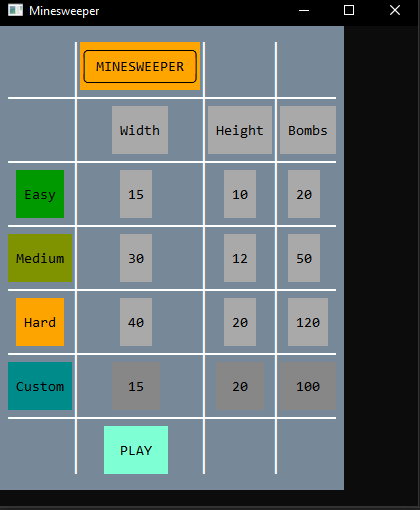
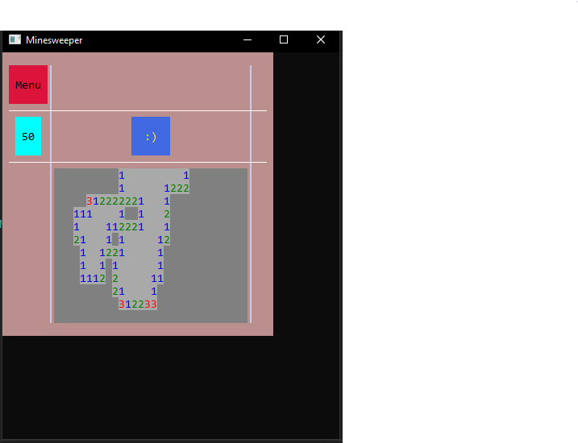
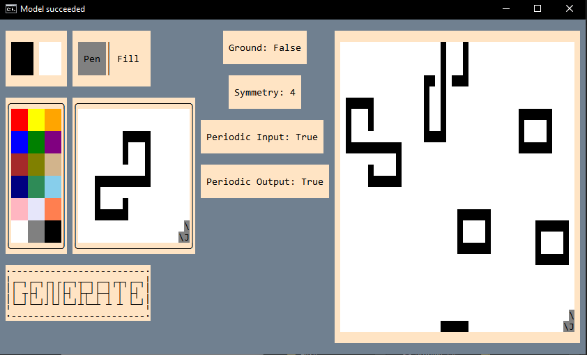
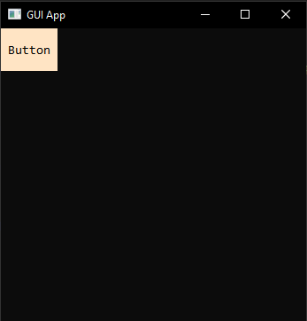
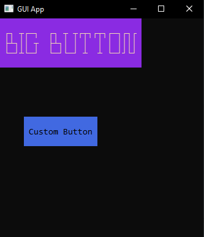

# ConsoleGUI

It's a simple C# library for creating GUI applications for console.

It provides basic set of customizable widgets with functional UI events.


## Setup

Clone the repo from GitHub:

```bash
git clone https://github.com/Atoen/ConsoleGUI.git
```

then include required namespaces in your project:

```csharp
using ConsoleGUI;
using ConsoleGUI.UI.Widgets;
```

and finally start the `Application`:

```csharp
Application.Start();
```
## Screenshots

Minesweeper game created using first version of the library.




Wave Function Collapse visualizer created using [OverlappingModel by Maxim Gumin](https://github.com/mxgmn/WaveFunctionCollapse) algorithm.



## Features

- Controls will respond to chnage of their properties automattically (eg. chaning size to match content)
- Customizable appearance: usage of `System.Drawing.Color` allows for full RGB color scheme
- Works both in Windows Terminal and CMD
- Numerous UI event to make the app feel more responsive (`MouseLeftDown`, `MouseEnter`, `MouseMove`, `KeyDown`, `KeyUp`, `GotFocus`, `LostFocus`, etc...)
- Built-in clipboard functionality through `Clipboard` class (not used anywhere at the moment).


## Usage/Examples

Creating basic controls is straightforward:

```csharp
using ConsoleGUI;
using ConsoleGUI.UI.Widgets;

Application.Start();

var button = new Button();
```



You can customize their appearance:
```csharp
var button = new Button
{
    Text = {Content = "Custom Button", Foreground = Color.Black},
    ColorTheme = Color.RoyalBlue,
    Position = (5, 5)
};
```

```csharp
var figletButton = new Button<BigText>
{
    // ConsoleGUI comes with 8 built-in FIGlet fonts
    Text = {Content = "Big Text", Foreground = Color.Black, Font = Font.CalvinS},
    ColorTheme = Color.RoyalBlue,
    MinSize = (20, 5)
};
```


Handling UI events:
```csharp
var button = new Button
{
    OnClick = () => Console.Title = "Clicked!"
};

button.MouseEnter += delegate(Control sender, MouseEventArgs eventArgs)
{
    Console.Title = $"Mouse entered {sender} at {eventArgs.CursorPosition}";
};
```
## Dependencies

This library uses the `Fody` and `MethodBoundaryAspect.Fody` NuGet packages. [Fody GitHub repo](https://github.com/mxgmn/WaveFunctionCollapse)

## License

Distributed under the MIT License. See `LICENSE.txt` for more information.
